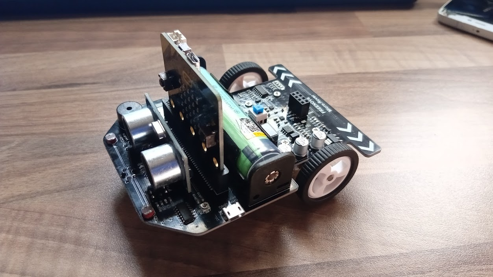
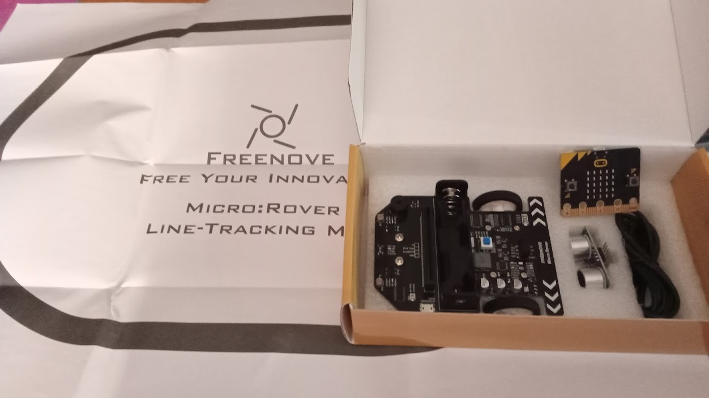
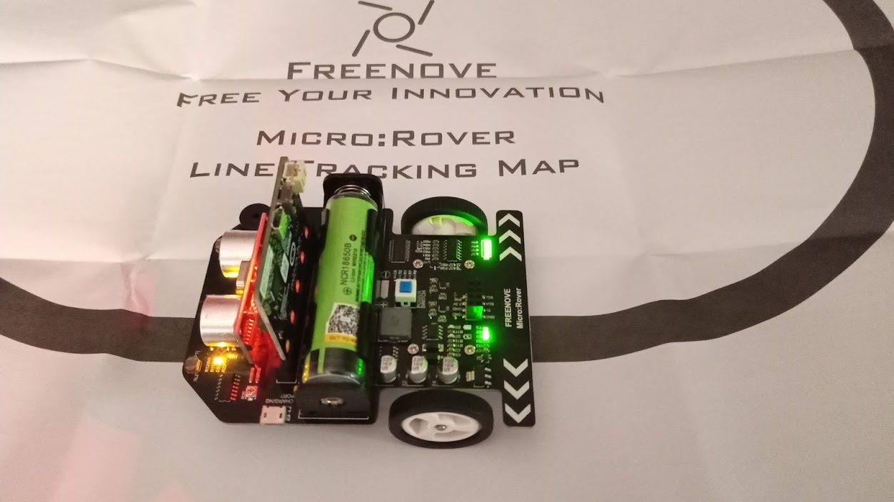
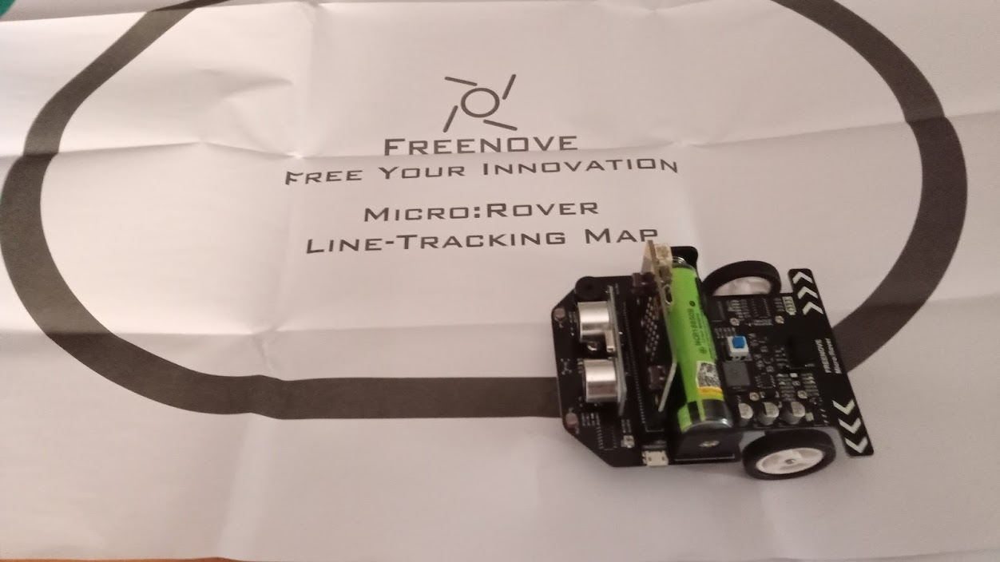

# Freenove microRover para micro:bit

[Freenove microRover](http://www.freenove.com/) es un robot pensado como complemento perfecto para aprender a programar robots con micro:bit

Viene casi completamente montado, a falta de conectar el sensor de ultrasonido y añadir una batería 18650 (que no viene incluída). También incluye un tapete de papel que nos sirve como circuito para el siguelíneas

La documentación es excelente y está disponible en su página web y en [github](https://github.com/Freenove/Freenove_Micro_Rover)

Podemos controlar el robot con una [aplicación Android](https://play.google.com/store/apps/details?id=com.freenove.suhayl.Freenove&hl=es_GT) o para iOS

También podemos programarlo usando el entorno de bloques [Makecode](https://makecode.microbit.org) sin más que añadir la correspondiente [extensión de Freenove para el microrover](https://github.com/Freenove/Makecode-Extension-Rover)

Si lo que queremos es programarlo usando python podemos hacerlo usando los [ejemplos incluidos](https://github.com/Freenove/Freenove_Micro_Rover/tree/master/PythonProjects)

También podemos hacer proyectos aún más complejos (tanto con bloques como con python) con la documentación incluida en su página de [proyectos extendidos](https://github.com/Freenove/Freenove_Micro_Rover_Extended_Projects), pero en este caso tendremos que incluir componentes que no están en el kit, como una pantalla LCD i2C

En definitiva se trata de un robot muy versatil y que nos permite trabajar diferentes niveles de programación, pudiendo adaptarse a los más pequeños, usando el control desde el móvil, a un nivel de programación inicial usando programación con bloques o a un nivel más avanzado usando python y accediendo a retos más complejos.

## Componentes del kit

* Placa micro:bit
* 2 motores con reductora
* 4 grupos de 3 x leds RGB
* Buzzer
* Sensor de ultrasonido
* 2 x Sensores de luz
* 3 x sensore infrarrojos para siguelíneas
* 1 conector i2c
* Cargardor de batería 18650 (no incluída en el kit)

## Conexiones GPIO

|micro:bit GPIO|Micro:Rover
|---|---
|P0|Buzzer
|P1|Light intensity sensor
|P2|Battery voltage acquisition
|P8| Expansion port
|P12|Ultrasonic ranging module trig pin
|P13|Ultrasonic echo pin
|P14|Left Infrared line-tracing sensor
|P15|Middle Infrared line-tracing sensor
|P16|Right Infrared line-tracing sensor
|P19| I2C SCL 
|P20| I2C SDA

Los motores y los leds RGB se controlan por i2c
 